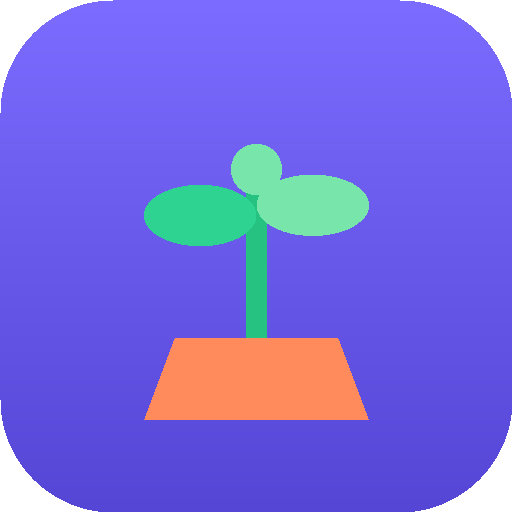

# 🌱 Rutina Quest

**Un juego de motivación para quienes aman procrastinar.** Registra tus tareas
diarias, complétalas para ganar recompensas y conviértelas en hábitos mientras
haces crecer a tu compañero.

Pensado para **teléfono y tablet**: es una app web (PWA) instalable, funciona
**sin conexión** y guarda todo el progreso en el propio dispositivo. No necesita
cuenta, servidor ni instalación de tiendas de apps.

<p align="center">
  
</p>

## 🎮 Cómo se juega

1. Elige tu nombre y un **compañero** (planta, pollito, gato o dragón).
2. Registra tus tareas en tres categorías:
   - 🧍 **Personales** — levantarme temprano, cepillarme los dientes, beber agua…
   - 🏠 **Hogar** — tender la cama, lavar los platos, lavar la ropa, hacer la comida…
   - 💼 **Trabajo** — terminar el reporte, hacer la presentación, responder correos…
3. Cada vez que completas una tarea recibes una **recompensa** (🪙 monedas + XP),
   confeti y un mensaje de ánimo.
4. Repite la tarea día tras día para subir tu **racha** 🔥. Al llegar a la meta
   (21 días por defecto), la tarea se convierte en un **hábito** 🌟.

### Dos tipos de tareas

- 🔁 **Hábito diario** — se repite solo cada día (no hay que volver a añadirlo) y
  construye racha para formar un hábito. Ideal para levantarse temprano, lavar
  los platos, beber agua…
- 📅 **Con fecha límite** — para entregas puntuales ("terminar el reporte en 20
  días"). La tarea **persiste día tras día** hasta su fecha y la encuentras en la
  pestaña **Agenda**, con calendario, cuenta regresiva y una barra de **avance**
  que subes poco a poco (+10 %, +25 %, +50 %), ganando recompensas en cada paso.

## ✨ Mecánicas de motivación

- **Recompensa inmediata:** monedas, experiencia y celebración en cada tarea, para
  vencer la procrastinación con gratificación instantánea.
- **Rachas y hábitos:** barra de progreso por tarea que muestra cuánto falta para
  formar el hábito. Bonus de monedas creciente por mantener la racha.
- **Agenda con calendario** 📅 para tareas con fecha de entrega: cuenta regresiva
  ("faltan 20 días"), recordatorios de lo que vence pronto y avance parcial con
  recompensas — perfecto para no dejar todo para el último día.
- **Avisos** 🔔 de entregas próximas o vencidas:
  - *Dentro del juego:* una campana con contador y lista de lo que está por
    vencer (siempre disponible, sin permisos).
  - *Del sistema:* notificaciones del dispositivo (opcionales) que aparecen al
    abrir el juego, con los días de antelación que elijas. En iPhone requieren
    tener la app añadida a la pantalla de inicio. *(Nota: al ser un juego sin
    servidor, los avisos se muestran al abrir la app, no en segundo plano.)*
- **Tu compañero crece contigo:** la mascota-planta evoluciona (🌱→🌿→🪴→🌳→🌸)
  a medida que subes de nivel.
- **Progreso del día:** anillo circular con el porcentaje de tareas completadas y
  mensajes que cambian según tu avance.
- **Logros** 🏆 desbloqueables (primer hábito, semana perfecta, nivel 10…).
- **Tienda** 🛍️ para gastar monedas en temas de color (Océano, Bosque, Atardecer,
  Medianoche).
- **Estadísticas** 📊 de tareas completadas, mejor racha, hábitos formados y más.
- Recordatorio háptico opcional (vibración) al completar una tarea.

## 🚀 Cómo abrirlo

**Opción rápida (local):**

```bash
cd rutina-quest
python3 -m http.server 8099
# abre http://localhost:8099 en el navegador del teléfono/PC
```

**En el teléfono/tablet:** abre la URL y usa *"Añadir a pantalla de inicio"* para
instalarlo como app a pantalla completa.

**Publicarlo gratis con GitHub Pages:** activa Pages en el repositorio y el juego
quedará disponible en `https://<usuario>.github.io/rutina-quest/`.

## 🧩 Estructura

```
rutina-quest/
├── index.html            Estructura de la interfaz
├── styles.css            Diseño móvil, temas y animaciones
├── app.js                Lógica del juego (tareas, rachas, recompensas, tienda…)
├── manifest.webmanifest  Configuración PWA (instalable)
├── sw.js                 Service worker (funciona sin conexión)
└── icons/                Iconos de la app (+ script que los genera)
```

Todo está hecho en **HTML, CSS y JavaScript puro**, sin dependencias ni frameworks.
El progreso se guarda en `localStorage`, así que es privado y vive solo en tu dispositivo.
